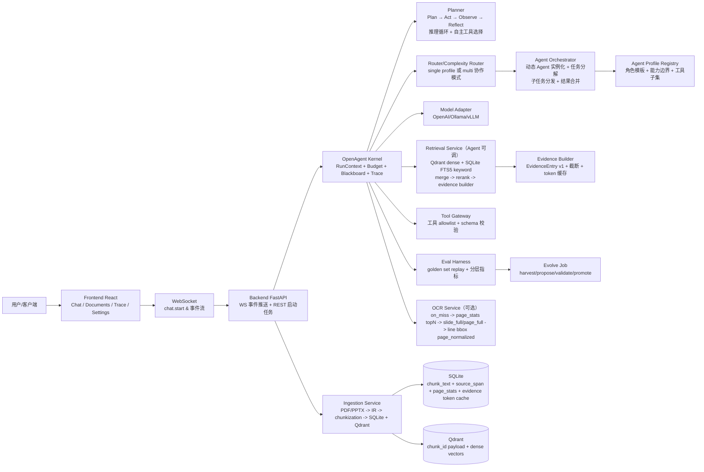

## OpenAgent 单用户工程架构（前后端分离 + React + WebSocket）

**产品定位**：OpenAgent 是 **单用户智能体（Agent）系统**——Kernel、Planner、工具网关、多 Agent 编排与预算是主干；文档侧的 **检索与证据链** 是 Agent 在需要 grounded 知识时调用的子能力，而不是把整体产品定义成「RAG 系统」。

### 1. 项目目标
- 单用户对话助手（无工作流 DAG 强制要求）
- 支持大模型提供商：`OpenAI` / `Ollama` / `vLLM`
- 知识库检索与证据（供 Agent 消费）：`Qdrant`（dense 向量）+ `SQLite FTS5`（关键词）+ `reranker` 重排
- 文档摄取：`PDF` + `PPTX`（先 text + table，OCR 作为可选兜底）
- chunk_text 全量落到 `SQLite`，证据可溯源
- OCR（可选，成本优先）：`on_miss` 触发 + `topN` 页面选择 + `line` 粒度 + bbox 坐标 `page_normalized`
- 自定义 Skill：受控能力片段注入（不扩权）
- 自主决策：Agent 具备 Plan → Act → Observe → Reflect 推理循环，可自主选择工具、判断检索充分性、决定是否追问
- Agent 生成：根据任务复杂度动态实例化 Agent Profile，支持多 Agent 编排协作与结果合并
- 评估机制：离线回放 + 分层指标（L0~L3）
- 自主进化：离线 sidecar（harvest -> propose -> validate -> promote），仅在 eval 门禁通过后发布
- 前端使用 `React`，通过 `WebSocket` 实时推送聊天流式输出与 trace/证据变化

### 2. 关键“受控边界”
- 模型可以“建议”启用 OCR/多 profile，但最终执行由 Kernel + 配置 + budget 决策
- 所有工具调用必须走 Tool Gateway（schema 校验/超时/审计/参数脱敏）
- Skill 注入只允许“prompt addon + retrieval hints + 工具 allowlist 子集”
- citation / evidence 只引用已入库的 `chunk_id -> source_span + version_id`
- 自主决策受控：推理循环最大轮次（`max_reasoning_rounds`）由 budget 硬限，Planner 产出的 plan 必须经 Kernel 合规校验后才可执行
- Agent 生成受控：动态实例化的 Agent Profile 必须基于 Profile Registry 中已注册的模板；禁止 Agent 自行扩大工具白名单或突破 budget 上限
- 多 Agent 协作受控：Orchestrator 是唯一的任务分发者，sub-agent 不可绕过 Orchestrator 直接通信；合并结果必须经过冲突检测

### 3. 总体架构图（建议用 Mermaid 渲染）


### 4. 仓库目录（顶层）
```text
openagent/
  OPENAGENT_ARCHITECTURE.md          # 本文件：整体架构与图
  README.md                          # 入口说明（可后续补）
  config/                            # 用户配置模板（provider/model/tokenizer/ocr）
  docker/                            # 容器化与运行说明
  constitutions/                    # 类似 CLAUDE.md 的宪法/行为约束
  docs/                              # 工程文档索引与写作规范（可后续扩展）
  backend/                           # FastAPI 后端（模块级设计文档）
  frontend/                          # React 前端（模块级设计文档）
  skills/                            # Skill manifest 与扩展说明
  eval/                              # 离线评估数据集与 fixture
  tests/                             # 单测/集成测试设计
  scripts/                           # 运行/导入/评估脚本（后续补）
  data/                               # 本地 SQLite/Qdrant 数据（不入 git）
``` 

### 5. WebSocket 事件粒度（Trace 增量展示）
聊天运行期间，后端按关键阶段推送事件：
- `chat.run_started`
- `chat.mode_selected`
- `chat.plan_generated`（Planner 产出的结构化执行计划，含 steps 摘要）
- `chat.plan_step_started`（当前执行的 plan step 索引与 action_type）
- `chat.plan_step_completed`（单步完成，含结果摘要与耗时）
- `chat.reflect_update`（Reflect 阶段评估结果：continue / replan / done，附原因）
- `chat.clarify_requested`（高歧义场景下 Agent 向用户追问，推送追问内容）
- `chat.retrieval_update`
- `chat.ocr_pages_selected`（仅 on_miss 触发后出现）
- `chat.evidence_update`（持续增量：dense/keyword/after_rerank/ocr 新增等）
- `chat.tool_call_started/finished/failed`
- `chat.agent_spawned`（multi 模式下 Orchestrator 实例化 sub-agent，含 agent_id / profile_id / 子任务描述）
- `chat.agent_progress`（sub-agent 执行进度增量：当前 step / evidence 状态）
- `chat.agent_completed`（sub-agent 完成，含结构化输出摘要）
- `chat.agent_failed`（sub-agent 失败，含错误原因与降级策略）
- `chat.merge_started`（Orchestrator 开始合并多 Agent 结果）
- `chat.conflict_detected`（合并时发现 Agent 间输出冲突，含冲突详情）
- `chat.delta`（assistant 文本流式增量）
- `chat.completed`（最终 citations + trace_summary）

### 6. 数据可溯源原则（必须写入文档/实现）
- 每个 `chunk` 必须绑定 `version_id`
- 每个 evidence 引用必须来自 `chunk_id`
- OCR chunk 必须满足：
  - `coord_space = page_normalized`
  - `source_span.region.bbox` 存储到 line bbox（强溯源）
- 表格 chunk 必须满足：
  - `table_ref` 包含表格定位信息（至少 table_id + row/col range）

### 7. 自主决策框架（Agent Reasoning & Planning）

#### 7.1 推理循环：Plan → Act → Observe → Reflect

Agent 采用 PAOR（Plan-Act-Observe-Reflect）循环作为核心推理范式：

```text
┌─────────────────────────────────────────────────────┐
│                   Reasoning Loop                     │
│                                                      │
│  Plan ──► Act ──► Observe ──► Reflect ──┐           │
│   ▲                                      │           │
│   └──────────── 继续/修正 ◄──────────────┘           │
│                    │                                  │
│                    ▼                                  │
│               Done（生成最终回答）                      │
└─────────────────────────────────────────────────────┘
```

- **Plan**：Planner 根据用户意图 + 当前 Blackboard 状态，生成结构化执行计划（`PlanSpec`）
  - 输出：`steps[]`，每步含 `action_type`（retrieve / tool_call / generate / clarify / delegate）、预期目标、依赖关系
  - Kernel 合规校验：step 中的工具/profile 必须在 allowlist 内，总步数不超过 `max_reasoning_rounds`
- **Act**：Runner 按 plan step 执行（检索、工具调用、子 Agent 委派等）
- **Observe**：将执行结果写入 Blackboard，更新 evidence/tool_result/error 状态
- **Reflect**：评估当前进展，决定下一步动作
  - 证据充分性检查：evidence 是否足够支撑回答？
  - 工具结果校验：tool output 是否符合预期 schema？
  - 自纠错触发：若 evidence 不足 → 追加检索；若工具失败 → 重试或降级；若答案矛盾 → 重新规划

#### 7.2 自主工具选择策略

Agent 不硬编码工具调用序列，而是基于以下信号自主决策：

| 决策信号 | 决定 | 示例 |
|---|---|---|
| 用户查询类型（factoid / analysis / creation） | 是否需要检索 | factoid → 必检索；creation → 可能不需要 |
| evidence 质量分数（reranker score 均值） | 是否追加检索/触发 OCR | 均分 < 阈值 → on_miss OCR |
| 工具 schema 与查询意图匹配度 | 选择哪个工具 | 计算类查询 → calculator tool |
| 已消耗 budget（llm_calls / tool_rounds） | 是否继续循环 | 接近上限 → 强制进入 generate |
| 对话历史上下文 | 是否追问用户 | 歧义度高 + 剩余 budget 充足 → clarify |

#### 7.3 歧义消解与追问策略

当查询意图不明确时，Planner 评估歧义度（基于 LLM 置信度 + 候选意图数量）：
- **低歧义**（单一明确意图）：直接执行
- **中歧义**（2~3 种可能意图）：选择最可能意图执行，回答中附带假设说明
- **高歧义**（意图不可判断）：生成 `clarify` step，向用户追问，暂停推理循环等待用户输入

#### 7.4 受控约束

- `max_reasoning_rounds`：推理循环硬上限（默认 5），由 Budget 控制
- `max_plan_steps`：单次 plan 最大步数（默认 8）
- `max_reflect_retries`：Reflect 触发重新规划的最大次数（默认 2）
- Plan 中任何 step 不得引用未注册的工具或 profile
- Reflect 不可自行提升 budget 或扩大工具白名单

### 8. Agent 生成与多 Agent 协作

#### 8.1 Agent Profile 数据结构

```text
AgentProfile:
  id:                string          # 唯一标识（如 "analyst", "summarizer", "fact_checker"）
  version:           string          # 版本号
  display_name:      string          # 展示名称
  role_description:  string          # 角色定位（写入 system prompt）
  system_prompt:     string          # 该 Agent 的 system prompt 模板（支持变量注入）
  tools_allowlist:   string[]        # 该 Agent 可使用的工具子集
  skills:            string[]        # 该 Agent 绑定的 skill id 列表
  retrieval_config:  object          # 检索策略覆盖（可选，如 top_k / reranker 偏好）
  budget_limits:     object          # 该 Agent 的独立 budget 上限（llm_calls / tool_rounds / tokens）
  output_schema:     object | null   # 该 Agent 输出的结构化 schema（用于结果合并）
```

所有 AgentProfile 必须在 **Profile Registry** 中注册，运行时通过 `profile_id` 引用。

#### 8.2 Agent 生命周期

```text
registered → instantiated → planning → executing → (cooperating)* → completed / failed → disposed
```

- **registered**：Profile 在 Registry 中注册，尚未实例化
- **instantiated**：Orchestrator 根据任务需要创建 Agent 实例，分配独立 RunContext 与 sub-budget
- **planning**：Agent 运行自身 Planner 生成执行计划
- **executing**：Agent 执行检索/工具调用/生成
- **cooperating**：多 Agent 模式下，通过 Blackboard 交换中间结果
- **completed / failed**：Agent 输出结构化结果或报告失败原因
- **disposed**：Orchestrator 回收资源，sub-budget 余量归还父级

#### 8.3 动态 Agent 实例化与任务分解

Router 判定 `mode=multi` 时，Orchestrator 负责任务分解与 Agent 实例化：

1. **任务分析**：Orchestrator 调用 LLM 将用户查询拆解为子任务（`SubTaskSpec[]`）
2. **Profile 匹配**：每个子任务匹配最合适的 AgentProfile（基于 role_description 语义相似度 + tools 覆盖度）
3. **实例化**：为每个子任务创建 Agent 实例，注入：
   - 子任务描述 + 父级 Blackboard 的相关快照
   - 独立 sub-budget（从父级 budget 中划拨）
   - 限定的 tools_allowlist（不超过 Profile 定义的白名单）
4. **执行**：子 Agent 独立或并行执行（并行度受 `max_concurrent_agents` 限制）

#### 8.4 多 Agent 协作协议

```text
┌──────────────────────────────────────────────┐
│              Orchestrator                     │
│   (任务分发 / 进度监控 / 结果合并 / 冲突解决) │
│                                               │
│   ┌──────┐   ┌──────┐   ┌──────┐            │
│   │Agent │   │Agent │   │Agent │            │
│   │  A   │   │  B   │   │  C   │            │
│   └──┬───┘   └──┬───┘   └──┬───┘            │
│      │          │          │                  │
│      └────┬─────┴────┬─────┘                  │
│           ▼          ▼                        │
│      Blackboard  (共享状态)                    │
└──────────────────────────────────────────────┘
```

- **通信方式**：所有 Agent 通过 Blackboard 命名空间通信（`blackboard.agent.{agent_id}.*`），禁止 Agent 间直接调用
- **结果合并策略**：
  - `merge_mode=concat`：直接拼接各 Agent 输出（适用于分段任务）
  - `merge_mode=synthesize`：Orchestrator 调用 LLM 综合各 Agent 输出为最终回答（适用于多视角分析）
  - `merge_mode=vote`：多个 Agent 对同一问题回答，取一致性最高的结果（适用于 fact-checking）
- **冲突检测**：若多个 Agent 输出存在事实矛盾（citation 冲突或结论相反），Orchestrator 标记冲突并：
  - 优先信任 evidence 支撑更强的 Agent
  - 必要时触发额外 Reflect 轮次或追问用户
- **超时与容错**：单个 sub-agent 超时或失败不阻塞整体流程；Orchestrator 可选择降级（忽略失败 Agent 输出）或重试

#### 8.5 Profile Registry 设计

- Profile 注册：通过配置文件或 API 注册，每个 Profile 必须通过 Kernel 合规校验（tools_allowlist ⊆ 全局注册工具集）
- 版本管理：Profile 修改产生新版本，旧版本保留用于 eval 回放
- Evolve 集成：离线进化可 propose 新 Profile 或修改现有 Profile 的 system_prompt / retrieval_config，但必须通过 eval 门禁后才能 promote