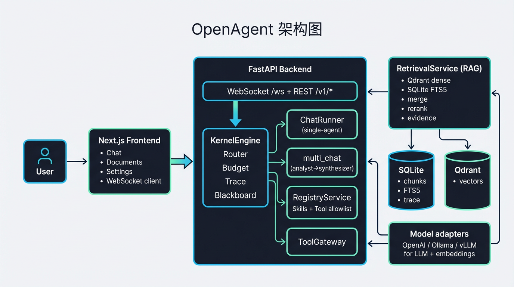

# OpenAgent

**简体中文** · [English](./README.en.md)

单用户 **智能体（Agent）** 应用：Kernel 编排、工具与 Skills 注册表、检索与可溯源证据；文档侧的向量/关键词检索是 Agent 的 grounded 能力之一，而非单独的「RAG 产品」形态。

更完整的架构与事件约定见根目录 [`OPENAGENT_ARCHITECTURE.md`](./OPENAGENT_ARCHITECTURE.md)；开发里程碑见 [`docs/DEVELOPMENT_PLAN.md`](./docs/DEVELOPMENT_PLAN.md)。**配置文件写法、环境变量、Tools / Skills / 提示词模板约定**见 **[`docs/CONFIGURATION.md`](./docs/CONFIGURATION.md)**（英文：[`docs/CONFIGURATION.en.md`](./docs/CONFIGURATION.en.md)）。

## 架构图



## 技术栈

| 层级 | 说明 |
|------|------|
| 后端 | Python 3.11+、FastAPI、Uvicorn、SQLite、Qdrant、可选 Ollama / OpenAI 兼容接口 |
| 前端 | Next.js 15、React 18、TypeScript、WebSocket 流式对话 |
| 配置 | `config/openagent.yaml`（可用 `OPENAGENT_CONFIG`）；[`docs/CONFIGURATION.md`](./docs/CONFIGURATION.md) / [`docs/CONFIGURATION.en.md`](./docs/CONFIGURATION.en.md) |

## 环境要求

- Python **≥ 3.11**
- **Node.js** 与 **pnpm**（前端）
- 若使用本地模型/嵌入：**Ollama**（或按配置使用 OpenAI / vLLM）
- **Qdrant**：可用嵌入式本地路径（见配置）或远程 URL

## 快速开始

### 1. 克隆与 Python 依赖

```bash
cd openagent
python -m venv .venv
source .venv/bin/activate   # Windows: .venv\Scripts\activate
pip install -e ".[dev]"
```

### 2. 配置

复制或编辑 [`config/openagent.yaml`](./config/openagent.yaml)：`models.generation`、`models.embedding`、`storage`（SQLite 路径、Qdrant 连接）等。完整字段说明、**`OPENAGENT_*` 环境变量规则**、**磁盘 Agent Skills（`skills/`）** 与 **工具别名** 等见 **[`docs/CONFIGURATION.md`](./docs/CONFIGURATION.md)**（英文 **[`docs/CONFIGURATION.en.md`](./docs/CONFIGURATION.en.md)**）。

嵌套项可用环境变量覆盖，例如：

```bash
export OPENAGENT_MODELS__GENERATION__PROVIDER=ollama
```

### 3. 启动后端

```bash
python scripts/start_server.py
```

默认监听 `http://127.0.0.1:8000`。可用 `OPENAGENT_HOST`、`OPENAGENT_PORT` 修改。

### 4. 启动前端

```bash
cd frontend
pnpm install
pnpm dev
```

浏览器访问 `http://127.0.0.1:3000`。若 API 不在本机 8000，可在前端 **Settings** 写入基址，或设置 `NEXT_PUBLIC_API_BASE`。

## 多智能体（MVP）

当 [`config/openagent.yaml`](./config/openagent.yaml) 中 `orchestration.multi_agent.enabled` 为 `true`（默认）时，用户消息在去掉首尾空格后以 **`trigger_prefix`** 开头（默认 **`[multi]`**）会进入 **两阶段编排**（analyst → synthesizer）；前缀不会进入实际提问正文。

示例：

```text
[multi] 请根据已导入文档总结要点
```

关闭：`orchestration.multi_agent.enabled: false` 或 `OPENAGENT_ORCHESTRATION__MULTI_AGENT__ENABLED=false`。

## API 与 WebSocket

- **REST**：文档导入、作业、trace、运行时配置等（见 `backend/api/routes/`）。
- **WebSocket**：`ws://<host>:<port>/ws`  
  - 客户端发送 `chat.start`（含 `query`、`client_request_id`、`stream` 等）  
  - 服务端推送 `chat.delta`、`chat.retrieval_update`、`chat.evidence_update`、`chat.tool_call_*`、`chat.agent_*`、`chat.completed` 等（与架构文档对齐）。

## 测试

```bash
# 后端单元测试
pytest tests/unit -q

# 前端（在 frontend 目录）
pnpm test
pnpm typecheck
pnpm exec eslint "src/**/*.{ts,tsx}" --max-warnings 0
pnpm exec playwright test   # 需已 playwright install
```

## 目录结构（摘要）

```text
openagent/
  README.md
  README.en.md
  OPENAGENT_ARCHITECTURE.md
  config/openagent.yaml
  docs/CONFIGURATION.md      # 配置与 Skills / 工具约定（中文）
  docs/CONFIGURATION.en.md   # Configuration guide (English)
  backend/           # FastAPI、Kernel、RAG、Registry、存储
  frontend/          # Next.js 应用
  scripts/start_server.py
  tests/unit/
  docs/
```

## 许可证

仓库根目录未附带 `LICENSE` 文件；使用前请与维护者确认授权方式。
